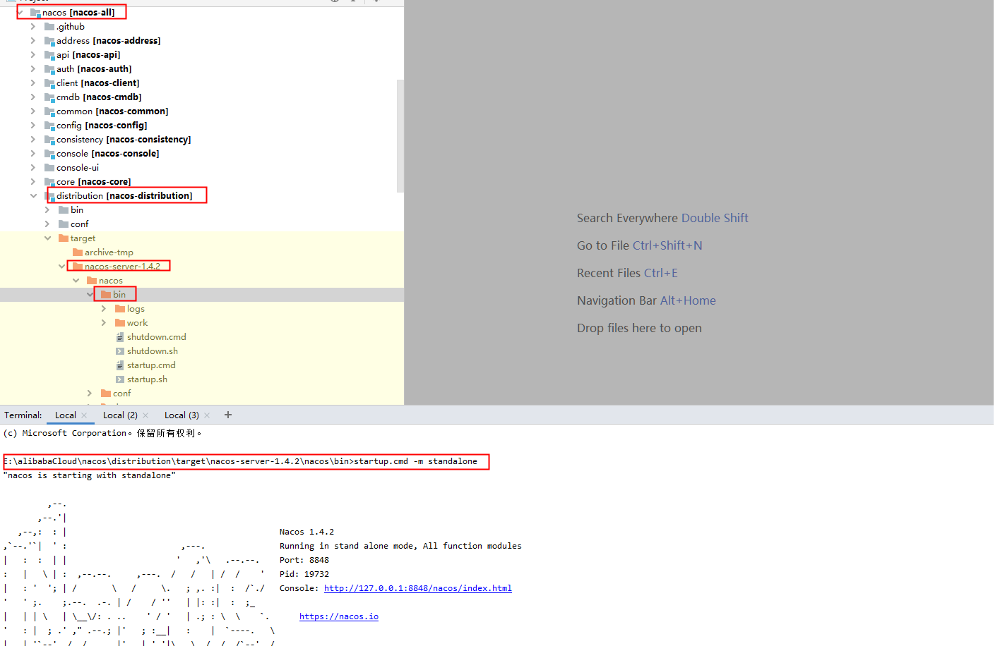
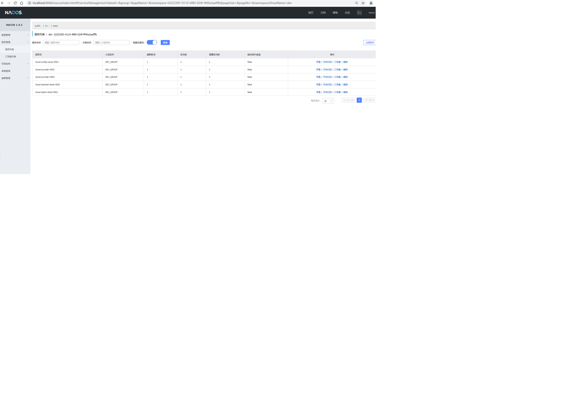
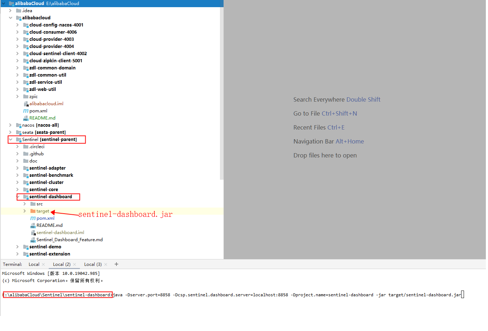
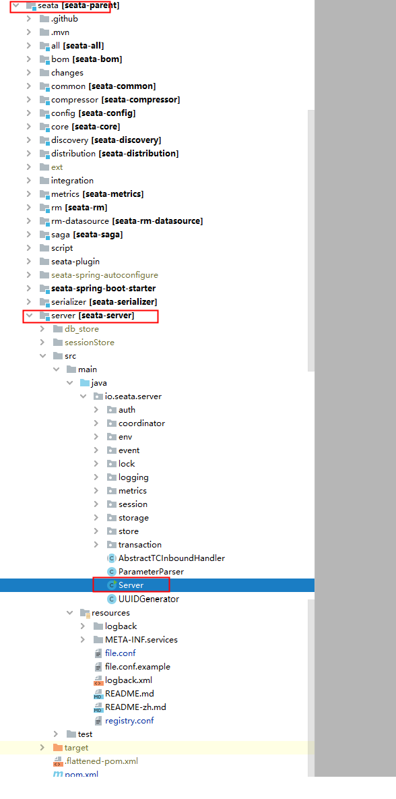
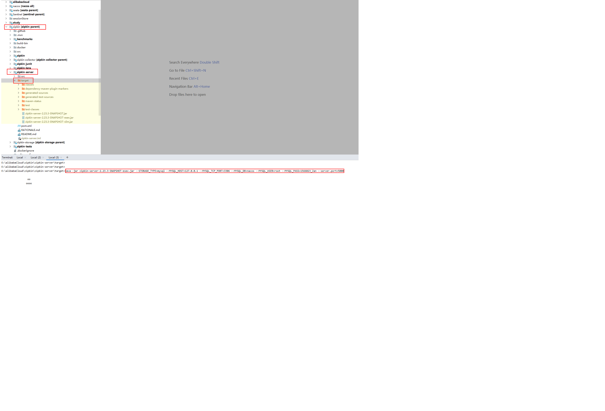
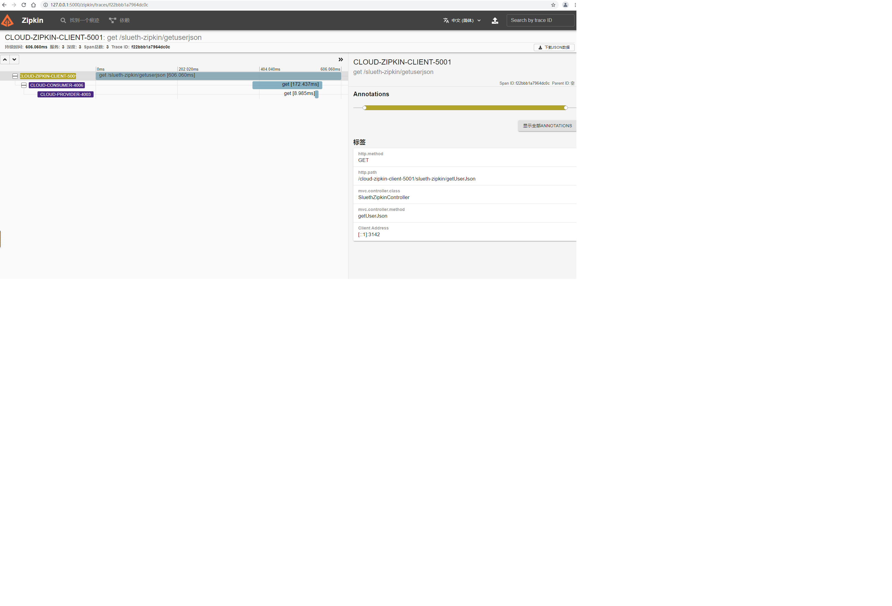
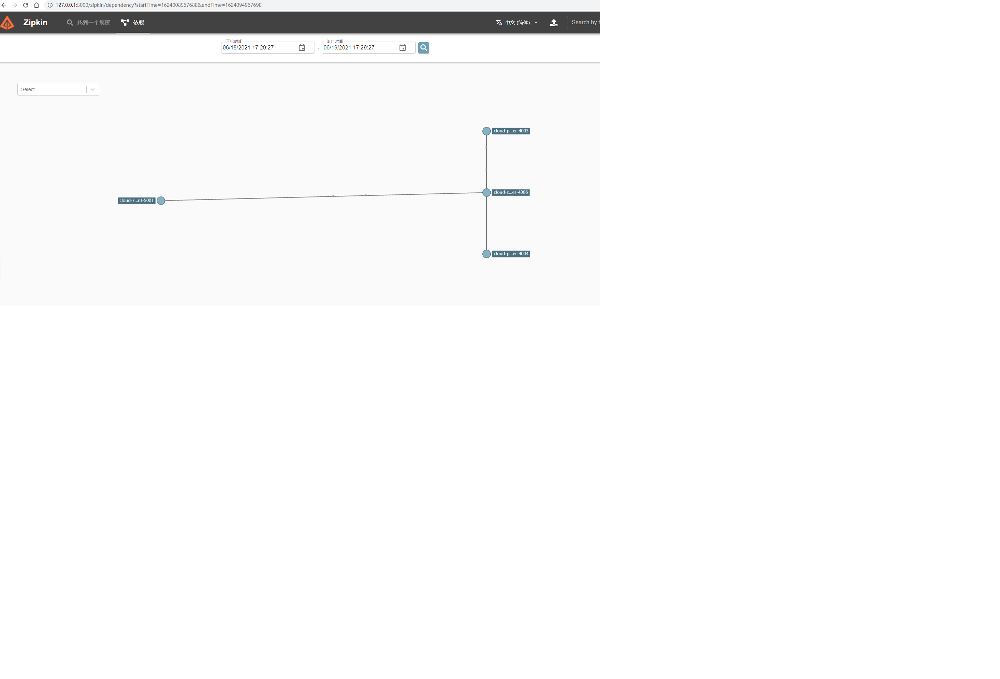

写的比较粗略，东西都在代码中，
nacos配置中心、sentinel、seata、zipkin等服务自己搭建，本项目主要是client代码。

技术栈：
SpringCloud Alibaba + nacos + Sentinel + Seata + (Slueth+zipkin) + OpenFeign + GateWay

mybatisPlus + druid 

请求url，从postman导出的，zpic/alibabacloud.postman_collection.json，可导入postman测试

==========================================================================================================================nacos注册中心+配置中心
源码下载:https://github.com/alibaba/nacos
编译
/nacos下运行
mvn -Prelease-nacos -Drat.skip=true -Dmaven.test.skip=true clean install -U

配置持久化mysql->修改\nacos\distribution\target\nacos-server-1.4.2\nacos\conf\application.properties
spring.datasource.platform=mysql
db.num=1
db.url.0=jdbc:mysql://127.0.0.1:3306/nacos?characterEncoding=utf8&connectTimeout=1000&socketTimeout=3000&autoReconnect=true&useUnicode=true&useSSL=false&serverTimezone=Asia/Shanghai
db.user=root
db.password=1566023_Zan

创建数据库nacos，并初始化nacos相关表\nacos\distribution\conf\nacos-mysql.sql

启动->
进入distribution/target/nacos-server-$version/nacos/bin
运行
startup.cmd -m standalone
停止 -  idea terminal 下可以直接Ctrl+z 停止
shutdown.cmd

=========================================================================================================================sentinel服务降级-限流、熔断、、
源码下载:https://github.com/alibaba/Sentinel/
编译
mvn -Dmaven.test.skip=true clean package
进入sentinel-dashboard
java -Dserver.port=8858 -Dcsp.sentinel.dashboard.server=localhost:8858 -Dproject.name=sentinel-dashboard -jar target/sentinel-dashboard.jar

持久化配置参考:https://www.jianshu.com/p/9a6cf8634805

[
    {
        "resource":"/cloud-config-nacos-4001/config/test",
        "limitApp":"default",
        "grade":1,
        "count":1,
        "strategy":0,
        "controlBehavior":0,
        "clusterMode":false
    }
]
resource：资源名称,即限流规则的作用对象
limitApp：来源应用,流控针对的调用来源，若为 default 则不区分调用来源
grade：阈值类型，0代表根据并发数量来限流，1代表根据QPS来进行流量控制
count：限流阈值
strategy：流控模式，0代表直接，1代表关联，2代表链路
controlBehavior：流控效果，0代表快速失败，1代表Warm Up，2代表排队等待
clusterMode：是否集群

=========================================================================================================================Seata分布式事务
源码下载:https://github.com/seata/seata
编译mvn install
修改E:\alibabaCloud\seata\server\src\main\resources下file.conf和registry.conf 配置mysql持久化及nacos
运行seata/server下io.seata.server.Server
main方法运行服务

=========================================================================================================================Slueth+zipkin链路追踪
zipkin server
下载源码编译，创建数据库及表
进入.\zipkin\zipkin-server\target>
运行
java -jar zipkin-server-2.23.3-SNAPSHOT-exec.jar --STORAGE_TYPE=mysql --MYSQL_HOST=127.0.0.1 --MYSQL_TCP_PORT=3306 --MYSQL_DB=nacos --MYSQL_USER=root --MYSQL_PASS=1566023_Zan --server.port=5000

=========================================================================================================================GateWay 未完待续